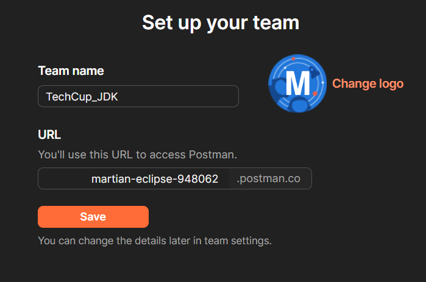
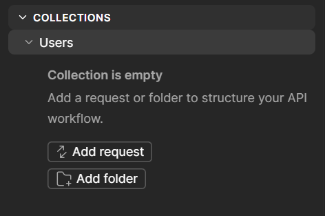
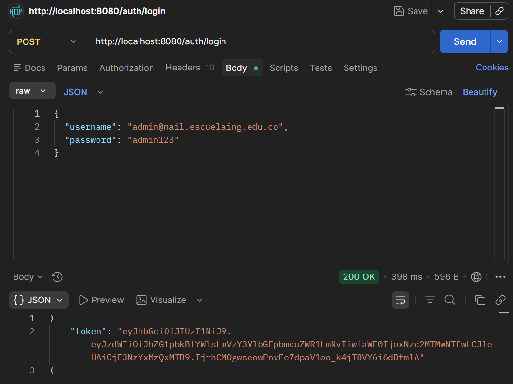
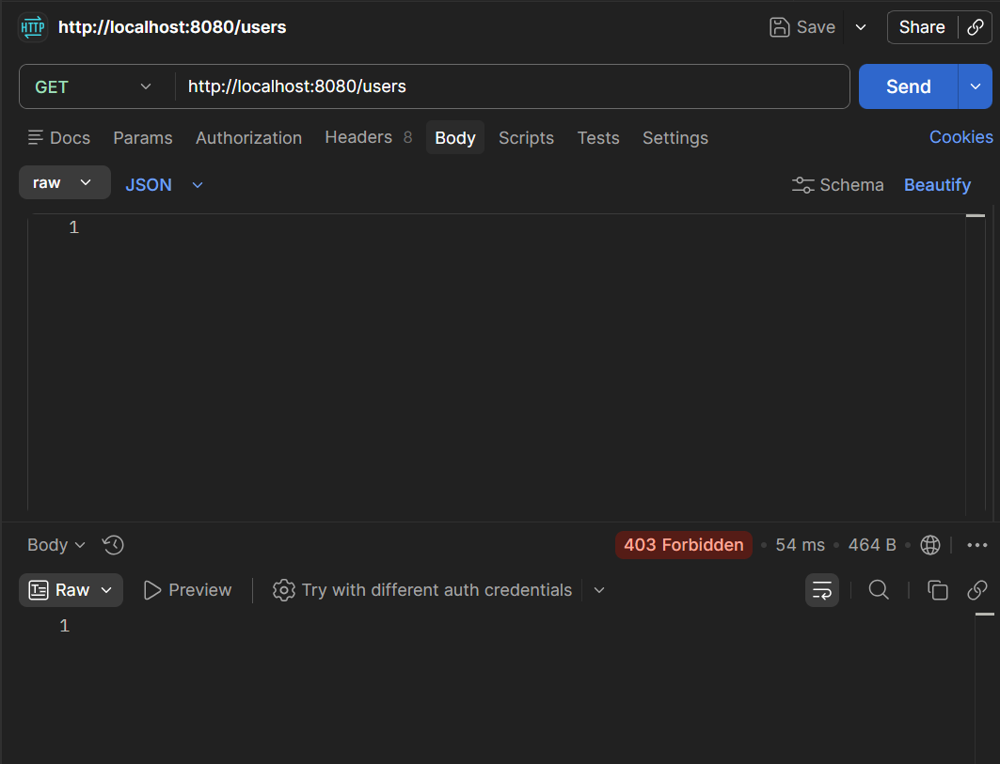
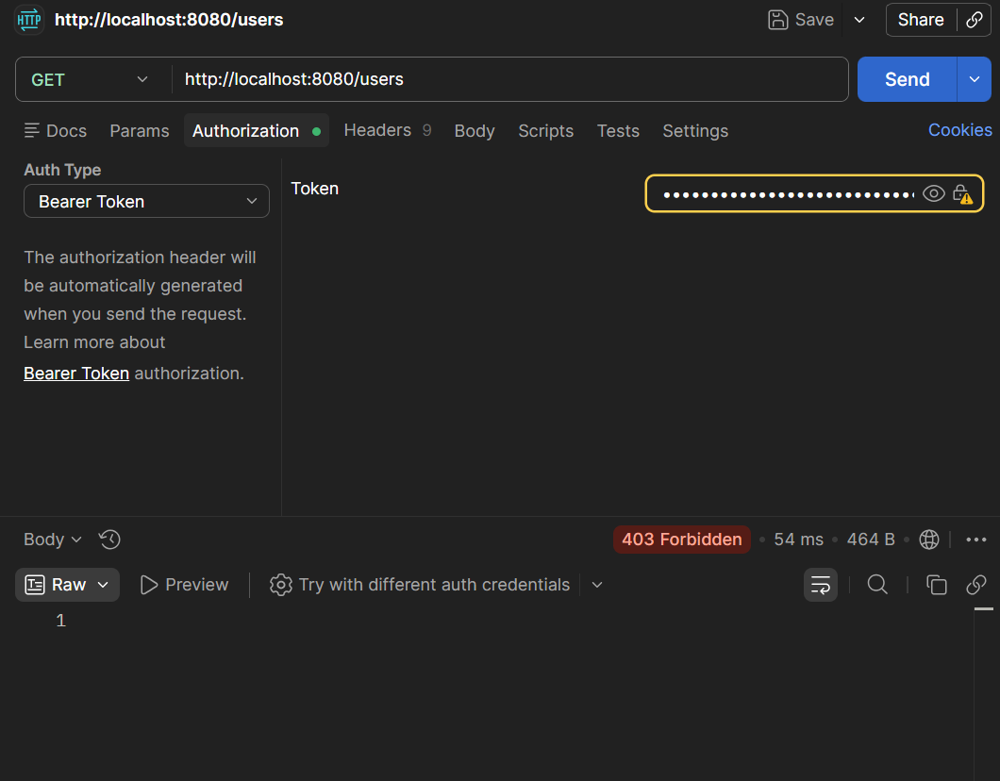
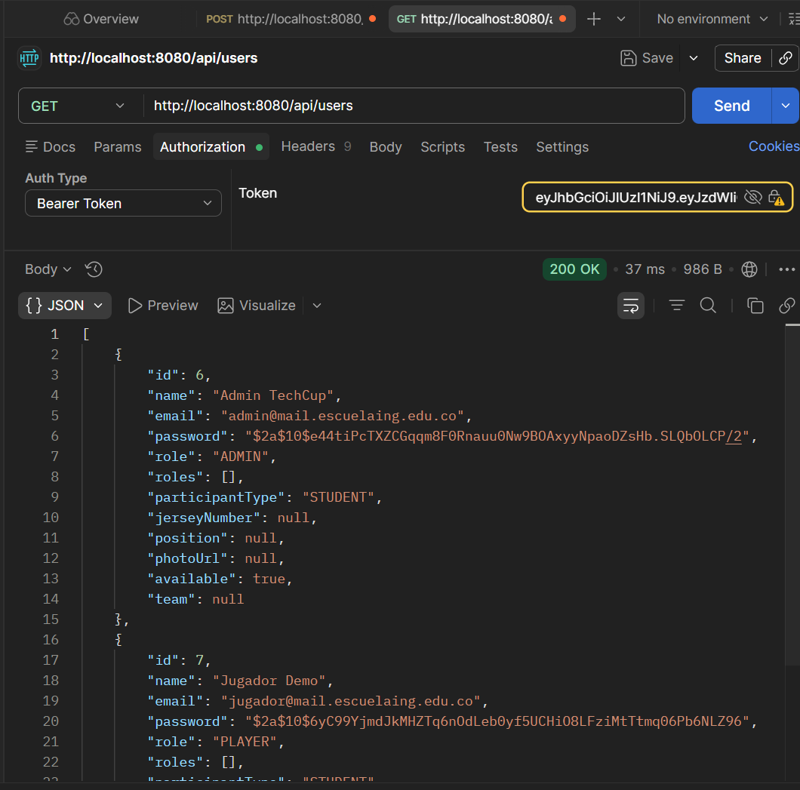

# TECHCUP FÚTBOL — Football Tournament Management System

Web platform for centralized management of the semester football tournament for the Software Engineering, Artificial Intelligence Engineering, Cybersecurity Engineering, and Statistical Engineering programs at Escuela Colombiana de Ingeniería Julio Garavito.

---

## Team Members

| Member | GitHub | Contact |
|--------|--------|---------|
| Maria Juliana Rodriguez Caicedo | @JuliRodC | maria.rodriguez@mail.escuelaing.edu.co |
| Kevyn Daniel Forero Gonzalez | @kevyn1005 | kevyn.forero@mail.escuelaing.edu.co |
| Diego Alejandro Montes Bonilla | @Banettchi | diego.montes@mail.escuelaing.edu.co |

---

## Technologies

| Layer | Technology | Version |
|-------|------------|---------|
| Backend | Spring Boot | 3.2.3 |
| Language | Java | 17 |
| Build | Apache Maven | 3.x |
| Persistence | Spring Data JPA / Hibernate | 3.2.3 / 6.4.4 |
| Mapping | MapStruct | 1.6.3 |
| Database | PostgreSQL | latest |
| In-Memory DB (tests) | H2 | latest |
| Security | Spring Security | 3.2.3 |
| JWT | JJWT (io.jsonwebtoken) | 0.13.0 |
| Validation | Spring Boot Validation | 3.2.3 |
| API Docs | SpringDoc OpenAPI | 2.6.0 |
| Testing | JUnit Jupiter + Mockito + Spring Security Test | 5.x |
| Quality | JaCoCo + SonarQube | 0.8.11 / 3.10.0 |
| CI/CD | GitHub Actions + Azure Web Apps | - |

---

## Requirements

- Java 17
- Apache Maven 3.9+
- Docker (to run PostgreSQL)

---

## Compilation and Execution

To compile the project run mvn clean compile. To execute the tests run mvn test or mvn verify for full verification. To start the application run mvn spring-boot:run.

The Swagger UI is available at http://localhost:8080/swagger-ui/index.html once the application is running.

---

## Database Setup (Docker)

The application connects to a PostgreSQL instance. Start a local container named postgres-techcup with database techcup_db, user postgres, password postgres, and port 5432. Make sure the container is running before starting the application.

---

## Architecture

This project follows a clean layered architecture with a dedicated security layer for JWT-based authentication:

| Layer | Package | Description |
|-------|---------|-------------|
| Entity | entity/ | JPA-annotated classes mapped to database tables |
| Model | model/ | Pure domain classes with business logic |
| Mapper | mapper/ | MapStruct interfaces for Entity to Model conversion |
| Repository | repository/ | Spring Data JPA interfaces for database access |
| Service | service/ | Business logic, uses repositories and mappers |
| Controller | controller/ | REST endpoints, returns ResponseEntity |
| Security | security/ | JWT filter, JWT service, and Spring Security configuration |

Services and controllers work exclusively with model classes. The entity layer is only accessed through repositories. MapStruct handles the conversion between both layers at compile time.

---

## Security — JWT Authentication

The application implements stateless authentication using JSON Web Tokens through three components in the security package.

JwtService handles the creation and validation of JWT tokens. A new token is signed with an HMAC-SHA key and is valid for one hour from the moment of issuance.

JwtAuthenticationFilter intercepts every HTTP request exactly once to check whether it carries a valid Bearer token in the Authorization header. If the token is present and valid, the user is registered as authenticated in the SecurityContextHolder so the rest of the application can identify them for the duration of that request.

SecurityConfig defines the access rules: the /auth/ endpoints and the Swagger UI are publicly accessible, while all other endpoints require a valid JWT. The filter is inserted into the security chain before Spring's default username-password filter.

### Authentication Flow

A client first calls the login endpoint with their email and password. The AuthController delegates to AuthService, which validates the credentials and returns a JWT token. The client then includes this token as a Bearer token in the Authorization header of every subsequent request. The JwtAuthenticationFilter validates the token on each call before the request reaches any controller.

---

## Domain Entities

The following entities cover the three core functionalities: authentication, user management, and tournament management.

---

### Role and Permission

Tables: roles, permissions

Role represents the different user types in the system. Permission defines fine-grained actions each role can perform. Both are used by Spring Security's UserDetails implementation to control access.

---

### User

Table: users

Represents any registered person in the system. Stores personal data, credentials, and the role that determines their permissions. Implements UserDetails from Spring Security to integrate with the authentication pipeline.

Key attributes: unique identifier, full name, email, password encrypted with BCrypt, availability status, participant type, and assigned role.

---

### Tournament

Table: tournaments

Represents the football tournament itself. Stores all the information the Organizer defines when creating it, and tracks its state throughout the semester. The tournament state changes over time: starts as Draft during configuration, becomes Active when registration opens, moves to In Progress during the competition, and ends as Finished.

Key attributes: unique identifier, start date, end date, registration cost per team, maximum number of teams, current status, and responsible organizer.

---

### Team

Table: teams

Represents a competing team. A captain creates the team, invites players, and submits the registration payment.

Key attributes: unique identifier, name, badge URL, uniform color, status, captain, list of players, and associated tournament.

---

### Match

Table: matches

Represents a scheduled game between two teams within a tournament. Stores the result once played.

Key attributes: unique identifier, date and time, field, home score, away score, phase (group stage / quarterfinals / semifinals / final), home team, away team, and tournament.

---

### Payment

Table: payments

Represents the registration payment submitted by a captain. The organizer reviews and approves or rejects it.

Key attributes: unique identifier, receipt URL, registration date, status (Pending / In Review / Approved / Rejected), and associated team.

---

### Entity Relationships

| Relationship | Type | Description |
|---|---|---|
| User → Tournament | ManyToOne | An organizer can manage multiple tournaments |
| User → Team (player) | ManyToOne | A player belongs to one team |
| User → Team (captain) | ManyToOne | A team has one captain |
| Tournament → Team | OneToMany | A tournament has multiple teams |
| Tournament → Match | OneToMany | A tournament has multiple matches |
| Team → Match | ManyToOne | Each match has a home and away team |
| Team → Payment | OneToOne | Each team has exactly one payment |

---

## Postman

## Testing

### Service Tests (Mockito)

Service tests mock the repository layer to avoid requiring a real database. Each test creates mock implementations of the repositories and mappers, injects them into the service under test, and verifies expected behaviors such as finding users, handling missing records, and processing tournament operations.

### Repository Tests (H2)

Repository tests use an in-memory H2 database activated with the test profile. They validate that JPA queries and save operations work correctly against a real database engine without requiring a running PostgreSQL instance.

### Security Integration Tests (MockMvc)

End-to-end tests that spin up the full Spring Boot context and validate the JWT security chain. They cover four scenarios:

- Successful login returns a valid JWT token.
- Login attempt with wrong password returns an HTTP error.
- Accessing a protected endpoint with a valid token returns a successful response.
- Accessing a protected endpoint without a token is rejected with an HTTP error.

---

## CI/CD Pipeline

The project uses GitHub Actions for continuous integration and deployment to Azure Web Apps. The pipeline triggers on every Pull Request targeting the develop or main branches and runs three sequential jobs:

| Job | Description |
|-----|-------------|
| Build | Checks out the code, sets up Java 17 (Temurin distribution), and compiles the project |
| Test | Depends on Build; runs the full test suite including unit and integration tests |
| Deploy | Depends on Test; packages the application as a JAR and deploys it to Azure Web Apps |

---

## Git Branching Strategy

Each feature was developed in isolation and merged via Pull Requests to develop:

| Branch | Content |
|--------|---------|
| feature/erd | Entity-Relationship diagram |
| feature/database-config | PostgreSQL configuration and Maven dependencies |
| feature/entities-selection | Domain entity selection and justification |
| feature/entities | JPA entity classes |
| feature/relationships | Entity relationships |
| feature/repositories | Spring Data JPA repository interfaces |
| feature/mapstruct | Entities, Models, and MapStruct mappers |
| feature/services | Repositories, Services, and Controllers |
| feature/repository-tests | JPA repository tests with H2 |
| feature/jwt | JWT service and authentication infrastructure |
| feature/jwt-filter | JWT authentication filter and Security configuration |
| feature/security-integration-test | End-to-end security tests and CI/CD pipeline |

---

## Laboratorio 9
### Punto 5: Filtro JWT

### a. ¿Qué es un filtro JWT?

Un filtro JWT (JSON Web Token) es un componente del backend que intercepta todas las peticiones HTTP entrantes antes de que lleguen a los controladores, con el propósito de verificar si el cliente está debidamente autenticado mediante un token JWT válido.

En Spring Boot, este filtro se implementa extendiendo OncePerRequestFilter, lo que garantiza que la lógica de validación se ejecute exactamente una vez por petición. El filtro extrae el token del encabezado Authorization, verifica su firma digital, su vigencia y su integridad, y si todo es correcto, registra al usuario como autenticado en el SecurityContextHolder para que el resto del sistema pueda identificarlo durante esa solicitud.

En este proyecto, la clase JwtAuthenticationFilter implementa esta lógica coordinando con JwtService para validar y extraer datos del token, y con UserDetailsService para cargar el usuario desde la base de datos.

---

### b. ¿Para qué sirven los filtros JWT?

Los filtros JWT son el mecanismo central para implementar autenticación y autorización sin estado (stateless) en APIs REST. Sus funciones principales son:

- Proteger endpoints: impiden el acceso a recursos sensibles si la petición no incluye un token válido.
- Eliminar el estado del servidor: al no usar sesiones HTTP, el servidor no necesita almacenar información de sesión; toda la identidad del usuario viaja en el token.
- Verificar la autenticidad: confirman que el token fue emitido por el servidor mediante firma criptográfica y que no fue alterado.
- Controlar la vigencia: detectan tokens expirados y rechazan automáticamente peticiones antiguas o reutilizadas.
- Integrarse con Spring Security: al registrar el usuario autenticado en el SecurityContextHolder, permiten que la configuración de seguridad funcione correctamente.
- Escalar fácilmente: al ser stateless, múltiples instancias del servicio pueden validar el mismo token sin necesidad de una sesión compartida, lo que facilita el despliegue en entornos como Azure Web Apps o contenedores Docker.

En resumen, los filtros JWT son la puerta de entrada del sistema de seguridad: determinan quién puede acceder y a qué, sin necesidad de consultar una sesión ni una cookie del lado del servidor.

---

### c. Bibliografía (Formato APA)

Jones, M., Bradley, J., & Sakimura, N. (2015). *JSON Web Token (JWT)* (RFC 7519). Internet Engineering Task Force. https://doi.org/10.17487/RFC7519

Auth0. (2024). *Introduction to JSON Web Tokens*. https://auth0.com/learn/json-web-tokens/

Walls, C. (2022). *Spring in Action* (6th ed.). Manning Publications.

Baeldung. (2024). *Spring Security and JWT authentication tutorial*. https://www.baeldung.com/spring-security-oauth-jwt

VMware, Inc. (2024). *Spring Security Reference — Servlet authentication*. https://docs.spring.io/spring-security/reference/servlet/authentication/index.html

io.jsonwebtoken. (2024). *JJWT — Java JWT: JSON Web Token for Java and Android* (v0.13.0). https://github.com/jwtk/jjwt
